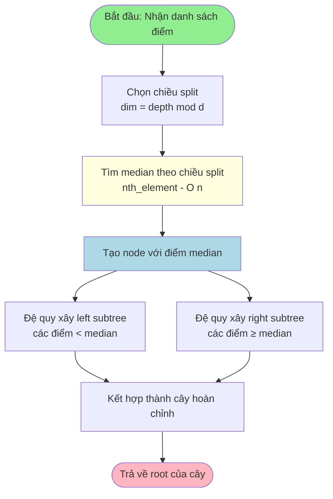
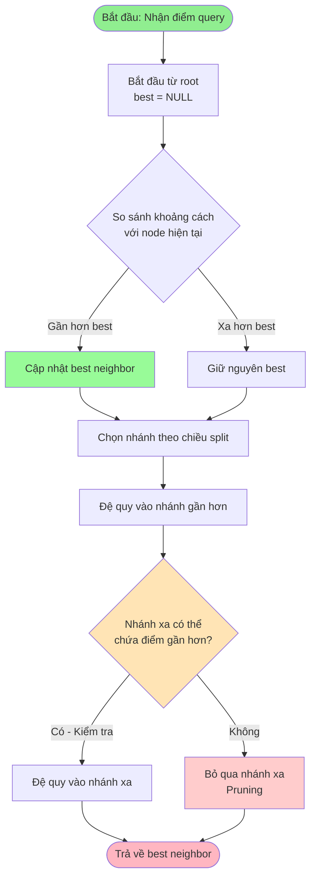

# Độ đo Cosine Similarity

## Công thức toán học

Cho hai điểm (vector) **A** và **B** trong không gian n chiều:

$$
\text{Cosine Similarity}(\mathbf{A}, \mathbf{B}) = \frac{\mathbf{A} \cdot \mathbf{B}}{||\mathbf{A}|| \times ||\mathbf{B}||} = \frac{\sum_{i=1}^{n} A_i \times B_i}{\sqrt{\sum_{i=1}^{n} A_i^2} \times \sqrt{\sum_{i=1}^{n} B_i^2}}
$$

Trong đó:
- $\mathbf{A} \cdot \mathbf{B}$ là tích vô hướng (dot product) của hai vector
- $||\mathbf{A}||$ là độ dài (norm) của vector **A**: $||\mathbf{A}|| = \sqrt{\sum_{i=1}^{n} A_i^2}$
- $||\mathbf{B}||$ là độ dài (norm) của vector **B**: $||\mathbf{B}|| = \sqrt{\sum_{i=1}^{n} B_i^2}$
- $n$ là số chiều của không gian (ở đây n = 10)

## Giá trị và ý nghĩa

- Giá trị cosine similarity nằm trong khoảng **[-1, 1]**
- **1**: Hai vector hoàn toàn giống nhau về hướng (tương đồng cực đại)
- **0**: Hai vector vuông góc (không tương quan)
- **-1**: Hai vector ngược hướng hoàn toàn

## Ví dụ tính toán

Cho hai điểm 3 chiều:
- **A** = (1, 2, 3)
- **B** = (4, 5, 6)

$$
\mathbf{A} \cdot \mathbf{B} = 1 \times 4 + 2 \times 5 + 3 \times 6 = 4 + 10 + 18 = 32
$$

$$
||\mathbf{A}|| = \sqrt{1^2 + 2^2 + 3^2} = \sqrt{14} \approx 3.742
$$

$$
||\mathbf{B}|| = \sqrt{4^2 + 5^2 + 6^2} = \sqrt{77} \approx 8.775
$$

$$
\text{Cosine Similarity}(\mathbf{A}, \mathbf{B}) = \frac{32}{\sqrt{14} \times \sqrt{77}} = \frac{32}{32.832} \approx 0.9746
$$

---

## Thuật toán Divide and Conquer với KD-Tree - O(n log n)

### Ý tưởng thuật toán

Sử dụng **KD-Tree** (K-Dimensional Tree) kết hợp với **chiến lược chia để trị (Divide and Conquer)**:

1. **Chuẩn hóa vector**: Tính norm và chuyển thành unit vectors - O(n×d)
2. **Xây dựng KD-Tree**: Phân chia không gian theo từng chiều - O(n log n)
3. **Nearest Neighbor Search**: Với mỗi điểm, tìm điểm gần nhất (loại trừ chính nó) - O(log n) average
4. **Chuyển đổi**: Khoảng cách Euclidean → Cosine similarity

**Công thức chuyển đổi**: Với unit vectors u, v:
- cos(θ) = 1 - 0.5 × ||u - v||²

### Sơ đồ khối thuật toán Divide and Conquer (KD-Tree)

```mermaid
flowchart TD
    Start([Bắt đầu: Đọc n điểm d chiều])
    Start --> CalcNorm[Tính norm cho tất cả điểm<br/>O n×d]
    CalcNorm --> Normalize[Chuẩn hóa thành unit vectors<br/>unit_i = coords_i / norm_i]
    Normalize --> BuildTree[Xây dựng KD-Tree<br/>O n log n]
    
    BuildTree --> Init[Khởi tạo<br/>max_similarity = -∞<br/>best_pair = -1, -1]
    Init --> LoopStart[i = 0]
    
    LoopStart --> FindNN[Tìm nearest neighbor của điểm i<br/>trong KD-Tree loại trừ i]
    FindNN --> CalcDist[Tính khoảng cách Euclidean<br/>dist² = ||unit_i - unit_j||²]
    CalcDist --> Convert[Chuyển đổi sang cosine<br/>cos = 1 - 0.5 × dist²]
    
    Convert --> Check{cos > max_similarity?}
    Check -->|Có| Update[Cập nhật<br/>max_similarity = cos<br/>best_pair = i, j]
    Check -->|Không| Skip[Bỏ qua]
    
    Update --> NextPoint
    Skip --> NextPoint{i < n-1?}
    
    NextPoint -->|Có| Increment[i = i + 1]
    Increment --> FindNN
    NextPoint -->|Không| Return[Trả về best_pair<br/>và max_similarity]
    
    Return --> End([Kết thúc<br/>In ra cặp điểm và độ tương đồng])
    
    style Start fill:#90EE90
    style End fill:#FFB6C1
    style Check fill:#FFE4B5
    style BuildTree fill:#ADD8E6
    style FindNN fill:#FFFFE0
    style Update fill:#98FB98
```

### Chi tiết xây dựng KD-Tree

### Sơ đồ chi tiết KD-Tree

#### 1. Xây dựng KD-Tree - O(n log n)



#### 2. Tìm Nearest Neighbor - O(log n) average



### Giải thích độ phức tạp O(n log n)

**Phương pháp Divide and Conquer với KD-Tree:**

1. **Xây dựng KD-Tree**: O(n log n)
   - Mỗi lần chia: O(n) để tìm median (sử dụng nth_element)
   - Độ sâu cây: O(log n)
   - Công thức đệ quy: T(n) = 2T(n/2) + O(n) = O(n log n)

2. **Tìm nearest neighbor cho n điểm**: O(n log n) average
   - Mỗi truy vấn: O(log n) average case
   - Tổng n truy vấn: n × O(log n) = O(n log n)

3. **Tổng độ phức tạp**: 
   - Chuẩn hóa: O(n×d)
   - Xây dựng KD-Tree: O(n log n)
   - n lần nearest neighbor: O(n log n)
   - **Kết quả**: O(n log n) (bỏ qua hằng số d)

**Lợi ích của KD-Tree:**
- **Pruning thông minh**: Loại bỏ các nhánh không cần thiết
- **Tránh so sánh toàn bộ**: Không cần kiểm tra tất cả O(n²) cặp
- **Hiệu quả với nhiều chiều**: Hoạt động tốt với không gian 10 chiều
- **Chuyển đổi đơn giản**: Khoảng cách Euclidean trên unit vectors ↔ cosine similarity

### Pseudocode thuật toán KD-Tree

```
FUNCTION findMaxCosineSimilarity_KDTree(points[], n, d):
    // Bước 1: Chuẩn hóa - O(n×d)
    FOR i = 0 TO n-1:
        norm[i] = sqrt(sum(points[i][k]² for k in 0..d-1))
        FOR k = 0 TO d-1:
            unit[i][k] = points[i][k] / norm[i]
    
    // Bước 2: Xây dựng KD-Tree - O(n log n)
    root = buildKDTree(unit, 0, n-1, 0)
    
    // Bước 3: Tìm max similarity - O(n log n)
    max_sim = -INFINITY
    best_i = -1, best_j = -1
    
    FOR i = 0 TO n-1:
        j = findNearestNeighbor(root, unit[i], i)
        dist_sq = sum((unit[i][k] - unit[j][k])² for k in 0..d-1)
        cos_sim = 1.0 - 0.5 * dist_sq  // Công thức chuyển đổi
        
        IF cos_sim > max_sim:
            max_sim = cos_sim
            best_i = i
            best_j = j
    
    RETURN (best_i, best_j, max_sim)

FUNCTION buildKDTree(points[], left, right, depth):
    IF left > right: RETURN null
    
    dim = depth MOD d
    mid = (left + right) / 2
    nth_element(points, left, mid, right, dim)  // O(n)
    
    node = new KDNode(points[mid], dim)
    node.left = buildKDTree(points, left, mid-1, depth+1)
    node.right = buildKDTree(points, mid+1, right, depth+1)
    RETURN node

FUNCTION findNearestNeighbor(node, query, query_id):
    best = null
    best_dist = INFINITY
    
    FUNCTION search(node, depth):
        IF node is null: RETURN
        
        IF node.id ≠ query_id:
            dist = euclideanDistance(node.point, query)
            IF dist < best_dist:
                best_dist = dist
                best = node
        
        dim = depth MOD d
        diff = query[dim] - node.point[dim]
        
        // Chọn nhánh gần trước
        first = (diff <= 0) ? node.left : node.right
        second = (diff <= 0) ? node.right : node.left
        
        search(first, depth + 1)
        
        // Kiểm tra nhánh xa nếu có thể chứa điểm gần hơn
        IF diff² < best_dist:
            search(second, depth + 1)
    
    search(node, 0)
    RETURN best.id
```

---

## Độ phức tạp thời gian

| Bước | Độ phức tạp | Ghi chú |
|------|-------------|---------|
| Đọc dữ liệu | O(n×d) | n điểm, d chiều |
| Tính norm | O(n×d) | Tính một lần |
| Chuẩn hóa | O(n×d) | Tạo unit vectors |
| Xây dựng KD-Tree | O(n log n) | Phân chia không gian |
| n lần tìm nearest neighbor | O(n log n) | Average case |
| **Tổng** | **O(n log n)** | **Bỏ qua hằng số d** |

**Lưu ý**: 
- Độ phức tạp O(n log n) là average case
- Worst case có thể lên đến O(n²) với dữ liệu đặc biệt
- Với dữ liệu thực tế, KD-Tree rất hiệu quả cho không gian 10 chiều
